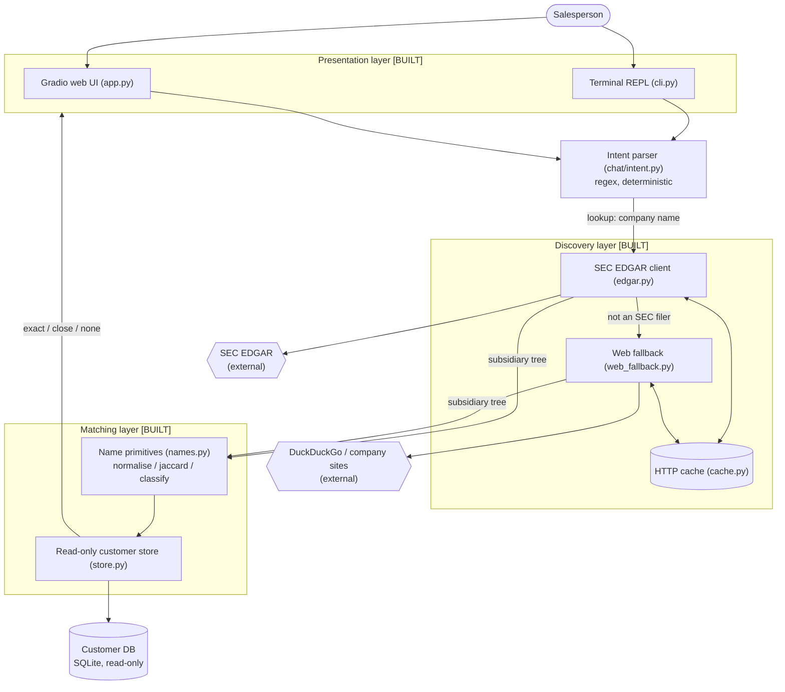
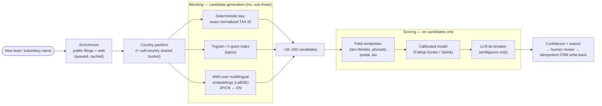

# Architecture & System Design — Sales Lead Research

> **Reading legend**
> - **[BUILT]** — implemented in this repository today (the SEC-EDGAR proof of concept).
> - **[TARGET]** — production design for the Michelin-scale deployment (millions of multilingual customer accounts). Not in this repo; included so the POC→production path is explicit.

This document is the architectural reference for the Sales Lead Research tool. It describes what the system does, how data flows, the major components, and — critically — how the proof of concept evolves into a system that scales to millions of dirty, multilingual customer records.

---

## 0. Purpose (what the tool does for a person)

A salesperson has a new lead — say "FedEx". Before they reach out cold, they want to know: **is this company, its parent, or any of its subsidiaries already a customer we have a relationship with?** If "FedEx Japan" rolls up to a parent we already serve, the rep can walk in warm — reference the existing relationship and tailor the proposal.

The tool automates the manual lookup. Given a company name, it:
1. Discovers the company's corporate family tree (parent + subsidiaries) from public filings.
2. Matches every entity in that tree against the internal customer database.
3. Reports which ones are already customers, with a confidence verdict, so the rep knows where the warm intros are.

---

## 1. Project Structure

```
sales_lead_research/
├── app.py                          # [BUILT] Gradio web chat UI (port 7860)
├── pyproject.toml / uv.lock        # uv-managed Python 3.12 project
├── src/sales_lead_research/
│   ├── __main__.py                 # `python -m sales_lead_research` entry
│   ├── cli.py                      # [BUILT] terminal chat REPL
│   ├── chat/
│   │   └── intent.py               # [BUILT] regex NL intent parser (no LLM)
│   ├── discovery/
│   │   ├── edgar.py                # [BUILT] SEC EDGAR: name→CIK→10-K/20-F→Exhibit 21→tree
│   │   ├── web_fallback.py         # [BUILT] non-SEC filers: web search → HTML/PDF extract
│   │   └── cache.py                # [BUILT] local HTTP response cache
│   └── matching/
│       ├── names.py                # [BUILT] normalise / jaccard / classify primitives
│       ├── store.py                # [BUILT] read-only SQLite customer store
│       └── init_db.py              # [BUILT] customer DB bootstrap
├── hf_space/app.py                 # [BUILT] Hugging Face Space deployment shim
├── scripts/init_dummy_db.py        # [BUILT] seed a dummy customer DB for demos
├── tests/                          # [BUILT] ~14 pytest modules (see §8)
└── docs/                           # methodology, ADRs, this document
```

**Separation of concerns:** four independent layers — *chat* (understand the request), *discovery* (find the corporate tree), *matching* (compare against customers), *presentation* (CLI / web). Each layer is pure-ish and independently testable; discovery and matching share no state.

---

## 2. High-Level System Diagram



**Text description:** the user types into the terminal or web chat. The intent parser decides whether the message is a company lookup. If so, the EDGAR client resolves the company and pulls its subsidiary tree from public filings; companies that don't file with the SEC fall through to a web search. Every name in the resulting tree is normalized and compared against the read-only customer database, and the matched/unmatched results are rendered back in the chat.

---

## 3. Core Components

### 3.1 Presentation — CLI + Gradio  [BUILT]
- **Responsibility:** accept a natural-language request, render the corporate tree and the customer-match results.
- **Technologies:** `rich` (tree rendering in the terminal), `gradio` (web chat on port 7860).
- **Deployment:** local CLI via `uv run python -m sales_lead_research`; web UI via `uv run python app.py`; public demo via a Hugging Face Space (`hf_space/`).

### 3.2 Intent parsing — `chat/intent.py`  [BUILT]
- **Responsibility:** map a raw query to a typed `Intent` (`lookup` / `exit` / `empty` / `unknown`) and extract the company name.
- **Design choice (per ADR-0003 §2):** **rules-first, regex-only** — zero new dependencies, deterministic, fully offline, instantly testable. No LLM in the routing path.
- **Security:** input is capped at 1024 chars to prevent pathological regex backtracking; `company_name` is explicitly treated as untrusted and must be escaped by downstream sinks.
- **[TARGET] evolution:** swap the regex front-end for an LLM intent+slot extractor when the surface area of phrasings grows beyond what regex maintainably covers — keeping the typed `Intent` contract so nothing downstream changes.

### 3.3 Discovery — `discovery/`  [BUILT]
The heart of "find the corporate family tree."

- **`edgar.py` — SEC EDGAR pipeline:**
  `resolve_cik` (name → 10-digit CIK via `company_tickers.json`) → `latest_10k_accession` (most recent **10-K**, falling back to **20-F** for foreign private issuers) → `exhibit_21_url` (locate the Exhibit 21 "list of subsidiaries" document) → `parse_exhibit_21` (HTML table → `(subsidiary_name, jurisdiction)` pairs). `fetch_subsidiary_tree` walks this **recursively to `max_depth=2`**, detecting which subsidiaries are themselves filers. `find_parent_company` does the reverse search. `search_companies` powers disambiguation.
- **`web_fallback.py` — non-SEC filers (DHL, Samsung, etc.):**
  DuckDuckGo HTML search → URL ranking (official "list of subsidiaries" PDF > annual report > Wikipedia > company domain; content farms demoted) → fetch top 5 → extract structure from **HTML tables** or **PDF** (`pypdf`), with a country-name vocabulary to detect jurisdictions and a financial-noise filter to drop line items that aren't companies.
- **`cache.py`:** local response cache so repeated lookups (and the large `company_tickers.json`) don't re-hit the network.
- **Technologies:** `httpx`, `beautifulsoup4`, `pypdf`.

### 3.4 Matching — `matching/`  [BUILT]
- **`names.py` (pure, no I/O):**
  - `normalise_name` — lowercase, strip brackets, drop trailing legal suffixes (`Inc`, `Ltd`, `GmbH`, `S.A.`, `K.K.`, …), collapse whitespace.
  - `jaccard_similarity` — token-set Jaccard on normalized forms.
  - `classify_match` — `exact` (normalized equality) / `close` (Jaccard ≥ 0.8) / `none`.
- **`store.py` (read-only):**
  - `open_store` — opens SQLite with `mode=ro` (writes raise at the SQL layer — defense in depth; no write helpers exist in the module).
  - `lookup_with_confidence` — buckets account IDs into `exact` / `close`.
  - **Blocking (built):** `open_store` builds an **in-memory token inverted index** once; `candidate_account_ids` then returns only rows that share a normalized token, so each lookup scores a handful of candidates rather than the whole table. Results are provably identical to a full scan (a zero-token-overlap row can be neither exact nor close). The **persistent / ANN / multilingual** version remains the production target (see §9).

---

## 4. Data Stores

### 4.1 Customer database  [BUILT]
- **Type:** SQLite, opened **read-only**.
- **POC schema:** `customers(account_id, company_name)`. Seeded with dummy data via `scripts/init_dummy_db.py`; path configurable via `SALES_DB_PATH`.
- **[TARGET] production schema:** `account_id, parent_account_id, company_name, headquarters, postal_code, tax_number, country, language`, mirroring the Michelin CRM. In production this is **read-through** to the CRM rather than a copy (see §7 on why copying the CRM is a data-governance risk).

### 4.2 HTTP cache  [BUILT]
- **Type:** local on-disk cache (`discovery/cache.py`).
- **Purpose:** avoid re-fetching `company_tickers.json` and previously seen filings/pages.

### 4.3 [TARGET] Candidate index + vector store
- **Type:** Postgres (`pg_trgm` + `pgvector`) or Elasticsearch + a vector index (FAISS/Milvus).
- **Purpose:** the **blocking** layer that makes million-row matching fast (see §9).

---

## 5. External Integrations / APIs

| Service | Status | Purpose | Method |
|---|---|---|---|
| **SEC EDGAR** | [BUILT] | Corporate hierarchy from 10-K / 20-F Exhibit 21 | REST over `httpx`, with a compliant `User-Agent` for SEC fair-use |
| **DuckDuckGo HTML** | [BUILT] | Discover annual-report / subsidiary pages for non-filers | HTML scrape |
| **Company investor sites** | [BUILT] | Source PDFs/HTML for subsidiary lists | `httpx` fetch + parse |
| **LLM provider** (OpenAI/Bedrock) | [TARGET] | Tie-breaking ambiguous matches; richer intent parsing | API |
| **Perplexity / search API** | [TARGET] | Higher-recall company disambiguation | API |
| **Michelin CRM** | [TARGET] | Read customer accounts; write back resolved `parent_account_id` | API, idempotent writes |

---

## 6. Deployment & Infrastructure

### Current  [BUILT]
- **Runtime:** Python 3.12, `uv`-managed.
- **Dev environment:** devcontainer (Python 3.12 + uv + GitHub CLI); port 7860 auto-forwarded for Gradio.
- **Hosting:** local CLI; Gradio web UI; Hugging Face Space for a shareable demo.
- **CI/CD:** `pytest` suite; conventional-commit discipline (one commit per issue).

### [TARGET] Production (AWS reference, matching the Ericsson JD)
- **Compute:** containerized services on **EKS** (Kubernetes); enrichment workers as a horizontally scaled pool.
- **Async backbone:** a queue (SQS / Kafka) decoupling *ingest → enrich → match → review → write-back* so each stage scales independently.
- **Model serving / GenAI:** SageMaker or Bedrock for the LLM tie-breaker and embeddings.
- **Stores:** managed Postgres (pgvector) or OpenSearch for blocking; object storage (S3) for cached filings.
- **Observability:** structured logs, per-stage latency metrics, match-quality dashboards (precision/recall over a labeled set), alerting on drift.

---

## 7. Security Considerations

### Current  [BUILT]
- **Least privilege on data:** customer DB opened `mode=ro`; the store module exposes **no write path** at all.
- **Injection guards:** `int(cik)` coercion before building EDGAR URLs ensures only digits flow into the URL template; user-supplied company names are documented as untrusted and escaped at sinks.
- **DoS guard:** 1024-char cap on chat input to bound regex work.
- **Fair-use compliance:** every SEC request carries a descriptive `User-Agent`.

### [TARGET] Production
- **Do not bulk-copy the CRM.** The POC builds a local replica of customer rows; production should **read-through** to the CRM. Tax numbers and customer relationships are sensitive commercial/PII data — copying millions of them into a third-party store is a governance and breach-surface problem.
- **AuthN/AuthZ:** OAuth2 / JWT for the service; RBAC so only sales roles can trigger write-backs.
- **Write-back safety:** human-in-the-loop confirmation before any `parent_account_id` write; idempotency keys; full audit trail; reversible updates (never a blind "update all").
- **In transit / at rest:** TLS everywhere; encryption at rest for cache and indexes; secrets via a vault, not env files.
- **Data residency:** Japanese/Chinese customer data may carry residency constraints — keep regional partitions in-region.

---

## 8. Development & Testing Environment

- **Test runner:** `pytest` — `uv run pytest`.
- **Test inventory (~14 modules):** `test_names`, `test_store`, `test_intent`, `test_nlq`, `test_edgar`, `test_exhibit21`, `test_20f`, `test_recursive`, `test_parent_resolution`, `test_web_fallback`, `test_non_sec_filer`, `test_cache`, `test_init_db`, `test_cli`.
- **Focus areas:** name normalization & classification, read-only store behavior, intent parsing, the full EDGAR pipeline (including 20-F foreign-filer fallback and recursive tree walks), and the non-SEC web fallback.
- **Methodology:** TDD (tests first), per the project's `CLAUDE.md`.

---

## 9. [TARGET] Scaling to Production — Entity Resolution at Michelin Scale

> This section is the design answer to the core question: *how do you match one lead against millions of dirty, multilingual customer records — fast?* The POC already does the first half — **in-memory token blocking** (§3.4). Production extends that same two-stage **blocking → scoring** shape with a persistent index, approximate-nearest-neighbor retrieval, multilingual handling, and a calibrated scorer.

### The principle
Never run the expensive comparator against every record. Split into:
1. **Candidate generation (blocking)** — cheap, high-recall, sub-linear: millions → ~50–200 candidates.
2. **Scoring** — expensive, high-precision: run only on the candidate set.



### Blocking strategies (run in parallel, union the candidates)
1. **Deterministic tax-ID match** — exact match on normalized tax/registration number. Tax IDs are near-unique; a hit resolves at ~100% confidence and short-circuits the rest.
2. **Trigram / n-gram inverted index** (`pg_trgm` or Elasticsearch) — survives typos and abbreviations ("Michlin N.A."). Millisecond lookup, not a scan.
3. **Multilingual semantic blocking** — encode names with a cross-lingual embedding (**LaBSE** / multilingual-e5), store in a vector index, retrieve by **approximate nearest neighbor**. This makes "ミシュラン" and "Michelin" collide **without lossy translation**. ANN (HNSW) is sub-linear.
4. **Country partitioning** — only search within the lead's country block; records with no country go in a shared bucket included in every search (so missing-country rows are never silently skipped).

### Scoring (on the ~50–200 candidates only)
- Per-field similarity vector: Jaro-Winkler / Levenshtein on name, token-set ratio, **phonetic** (Double Metaphone for Latin; pinyin/romaji transliteration first for CJK), exact flags on tax/postal.
- Feed the vector into a **calibrated probabilistic record-linkage model** (Fellegi-Sunter, as implemented by **Splink**) so confidence is a real probability — not a hand-tuned "if name+country+tax then 99%" rule. Emit a **reason** (which fields matched/didn't) alongside the score.
- **LLM only as tie-breaker** on the few genuinely ambiguous candidates — a handful of calls per lead, not millions.

### Latency & throughput budget
- Blocking (tax lookup + trigram + ANN): **tens of ms** against a warm index.
- Scoring ~100 candidates: **single-digit ms** (vectorized).
- LLM tie-break on ~3 ambiguous: **~1–2 s** (only when needed).
- **The real cost is enrichment** (filings + web), measured in seconds–minutes — *not* the match.

### Batch of 5,000 leads
- Indexes are **built once, offline** — not per lead.
- A **queue** decouples enrichment from matching; workers scale horizontally; throughput is bounded by external rate limits (SEC/search), not by the match.
- **Cache** company→public-data lookups so the same parent isn't fetched 50 times.
- Matching becomes a **vectorized batch job**; write-backs are **idempotent** with an audit trail.

---

## 10. Future Considerations / Roadmap

- **[TARGET]** Replace full-scan matcher with the blocking+scoring pipeline (§9).
- **[TARGET]** Multilingual support: Unicode NFKC normalization, CJK transliteration, multilingual embeddings.
- **[TARGET]** Read-through CRM integration replacing the local customer copy.
- **[TARGET]** Human-review UI for confirming matches and write-backs; CSV export of matched/unmatched.
- **[TARGET]** Calibrated confidence + reason column via Splink.
- **[BUILT→improve]** Broaden intent coverage; consider LLM intent extraction behind the existing typed contract.
- **Known debt:** recursive EDGAR walk is depth-capped at 2 and re-fetches the ticker index per call; web-fallback extraction is heuristic and source-dependent.

---

## 11. Project Identification

- **Project Name:** Sales Lead Research
- **Description:** Chat tool that pulls a company's parent/subsidiary structure from public filings and flags which entities are already customers.
- **Tech Stack:** Python 3.12 (uv), httpx, beautifulsoup4, pypdf, rich, gradio, pytest, SQLite. Data source: SEC EDGAR + web.
- **Primary entry points:** `python -m sales_lead_research` (CLI), `app.py` (web).
- **Date of Last Update:** 2026-05-29

---

## 12. Glossary

| Term | Plain-English meaning |
|---|---|
| **CIK** | SEC's unique ID number for a company that files with it. |
| **10-K / 20-F** | Annual report a US company (10-K) or a foreign company (20-F) files with the SEC. |
| **Exhibit 21** | The section of an annual report that lists the company's subsidiaries. |
| **Entity resolution** | Deciding whether two records ("Michelin N.A." vs "Michelin North America") refer to the same real-world company. |
| **Blocking** | Cheaply narrowing millions of records down to a few candidates before doing expensive comparisons. |
| **ANN (approximate nearest neighbor)** | Fast "find the most similar vectors" search that doesn't check every record. |
| **Embedding** | A numeric fingerprint of text; similar meanings → nearby numbers. Multilingual embeddings put translations near each other. |
| **LaBSE** | A language-agnostic embedding model good at matching company names across languages. |
| **Fellegi-Sunter / Splink** | The standard statistical method (and a library) for scoring whether two records match, giving a calibrated probability. |
| **Jaccard / Jaro-Winkler** | Two ways to measure how similar two strings are. |
| **Idempotent** | An operation you can safely run twice without doubling its effect — important for safe CRM write-backs. |
