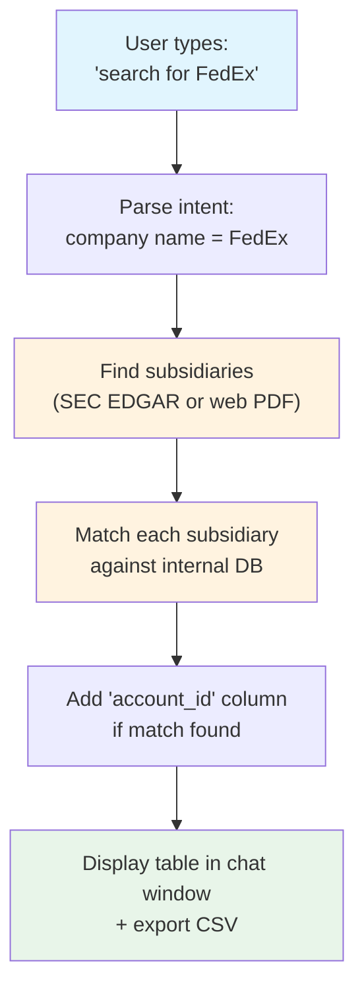

# Product Context — Sales Assistant Chat (with DB Matching)

## What We Are Building

A chat tool (terminal or web) with an interface like Claude's chat window. The user types natural language queries. Behind the chat is a relational database containing existing customer details:

- `company_name`
- `account_id`
- `parent_id`
- `ultimate_parent_id`
- `location`
- `country`
- `tax_number`
- `zip_code`

When a user asks something like "search for FedEx", the tool:

1. Finds the subsidiary tree of FedEx (using the same SEC / web-fallback logic from the earlier lead-research tool).
2. Matches each subsidiary name against the database (fuzzy or exact, as defined).
3. Returns the subsidiary list with an extra column showing the `account_id` if that subsidiary already exists in the DB — otherwise leaves it blank or marks "not in DB".

The output is a table (or tree + table) that tells the salesperson: "Here are all legal entities under FedEx — and here's which ones we already have as customers (with their account ID)."

## How a Lookup Flows

<!-- Text summary for accessibility: User types a natural-language query in the chat. The tool parses intent to find the company name. It then runs the existing subsidiary discovery engine (SEC EDGAR first, web-fallback PDF second). Each subsidiary is matched against the internal customer database by company name. Matches are enriched with the account_id column. The result is rendered as a table (or tree + table) in the chat, and a CSV is exported alongside. -->



The subsidiary discovery step is identical to the previous tool's logic (SEC Exhibit 21, fallback to annual-report PDFs). The new part is the DB lookup and enrichment.

## Why

Salespeople already have a CRM-like database of existing customers. When they prospect a new parent company (e.g., FedEx), they need to know:

- Which subsidiaries of FedEx **are already our customers** — so they don't cold-call an existing account.
- Which subsidiaries are **not yet customers** — those become leads.
- The `account_id` lets them pull up the full customer record instantly.

Manually cross-referencing a subsidiary list against a database is slow and error-prone. This tool does it in seconds, inside the same chat where they type the query.

## Target Users

Internal sales team. They are comfortable typing natural language like "find subsidiaries of DHL and show me which ones we already have in the system". They are **not** developers. The chat window feels familiar (like Claude or ChatGPT). Output is a clean table with clear "existing account" markers.

## Success Criteria

- Given a query like "search for FedEx", the tool returns a list of subsidiaries with an `account_id` column populated wherever a match exists in the DB.
- If the DB has no match for a subsidiary, the `account_id` cell is empty or shows `—`.
- The subsidiary discovery works for both SEC-listed and non-SEC companies (same reliability as the earlier tool).
- The chat understands variations: "show me FedEx's subsidiaries", "FedEx tree", "which FedEx entities do we have?"
- Every successful run also writes a CSV with the enriched subsidiary list (for CRM import or sharing).
- The tool never crashes on a malformed query or missing DB connection — it returns a plain-English error.

## Non-Negotiables

- **Natural language first.** The user does not need to learn a command syntax. "search for X", "find subsidiaries of Y", "show me Z's tree" all work.
- **DB matching is explicit.** The extra `account_id` column is always present, even if empty. No silent merging of data.
- **Data freshness.** Subsidiary list comes from the latest available public filing (same as before). The DB is queried live — no long-term cache of matches, because account IDs can change.
- **Plain English errors.** "I couldn't find FedEx in SEC filings or web PDFs" — not `KeyError: 'subsidiaries'`.
- **CSV export is not optional.** Every successful lookup produces an enriched CSV alongside the chat output.

## Scope for v1

**In scope.**
- Chat loop (terminal or Gradio web UI) that accepts natural language.
- Subsidiary discovery engine (reuse the existing SEC + web-fallback code).
- Internal DB connection — **SQLite for v1** (open-source, zero-ops, single file). PostgreSQL remains a future option if we need multi-user or server deployment.
- Exact-match or simple fuzzy matching (normalised name; strip "Inc.", "Ltd.", etc.) between subsidiary names and the DB's `company_name`.
- Output as a rich table in the chat plus a CSV export with the extra `account_id` column.
- The DB is **read-only** for this tool — no writes back to the CRM.

**Out of scope.**
- Writing new customer records to the DB.
- Updating parent / ultimate parent relationships inside the DB based on the subsidiary tree.
- Multi-user authentication. v1 assumes a single internal user or a shared read-only DB.
- Complex fuzzy matching (Levenshtein, phonetics) unless a concrete need emerges.
- Matching on fields other than `company_name` (e.g., tax number, location).

## Decision Style

- **Reuse, don't rebuild.** The subsidiary discovery engine stays exactly as before. We only add the DB query and column enrichment.
- **Test the match logic.** Unit tests for "subsidiary name X matches DB company name Y" with a small set of edge cases (parentheses, punctuation, "DHL Express (Portugal) Lda.").
- **Fail gracefully.** If the DB is unreachable, the tool still returns the subsidiary list with a warning: "Could not reach customer database — showing subsidiaries without account IDs."
- **Boring tech.** Python, the standard-library `sqlite3` module, `rich` tables, same dependencies as before. Everything in the stack is open source and free.

## Decisions (confirmed by the human on 2026-04-20)

1. **Matching rule.** Case-insensitive + strip common legal suffixes on both sides. **Also show "close" matches** with a clear *"possibly ACCT-1234 — verify"* marker so the salesperson knows to double-check.
2. **Multiple customer-list matches for one subsidiary.** Show all account IDs, comma-separated in the cell.
3. **Tree structure.** Preserved in the chat output as an indented tree. The spreadsheet is a flat list with the extra `account_id` column.
4. **Parent relationships in the customer list.** The schema has `parent_id` and `ultimate_parent_id`. The tool does **not** validate or update those — it only reads `company_name` and `account_id`.
5. **Database.** SQLite for v1 — open source, single file, zero-ops. Path from env var `SALES_DB_PATH`, with a sensible default under the project's data directory.
6. **Stale subsidiary lists.** Every answer shows the filing date of the source (e.g. *"Subsidiaries from FedEx's 10-K filed 2025-04-15"*) so the salesperson can judge freshness.
7. **Chat window vs. search box.** Chat window — even knowing it's more fragile than a labelled search box. Multi-turn refinement ("now show me just the French ones") is worth the parsing risk.
8. **Single user for v1.** Optimise for one salesperson on one laptop. Multi-user, shared-drive customer list, and authentication are v2 concerns.
9. **Online version and customer data (accepted risk).** The online version (Hugging Face hosted) can also read the customer list. The human is aware this means customer data — including tax numbers and postcodes — is uploaded to a third-party hosting provider. Accepted as a v1 trade-off.

## Relationship to the Earlier "Sales Lead Research" Tool

- The earlier tool was standalone — it only discovered subsidiaries and wrote a CSV.
- This new tool extends that discovery with a DB lookup.
- The subsidiary discovery code can be imported as a library. The chat layer is new.
- The earlier tool's non-negotiables (plain English, CSV export, right-to-left country scan) still apply here.

## What a Chat Session Looks Like

```text
> search for FedEx

Finding subsidiaries of FedEx (via SEC EDGAR)...
Found 142 subsidiaries.

Matching against customer database...
23 subsidiaries already have an account ID.

Here is the subsidiary list with account IDs (indented tree):

FedEx Corporation
├── FedEx Express
│   ├── FedEx Express (France) SAS  [Account: ACCT-4321]
│   ├── FedEx Express (Germany) GmbH  [—]
│   └── FedEx Express (UK) Ltd  [Account: ACCT-5678]
├── FedEx Ground
│   ├── FedEx Ground (Canada) Inc  [—]
│   └── FedEx Ground (Mexico) S de RL  [Account: ACCT-9012]
...

CSV saved: FedEx_subsidiaries_enriched.csv
```
